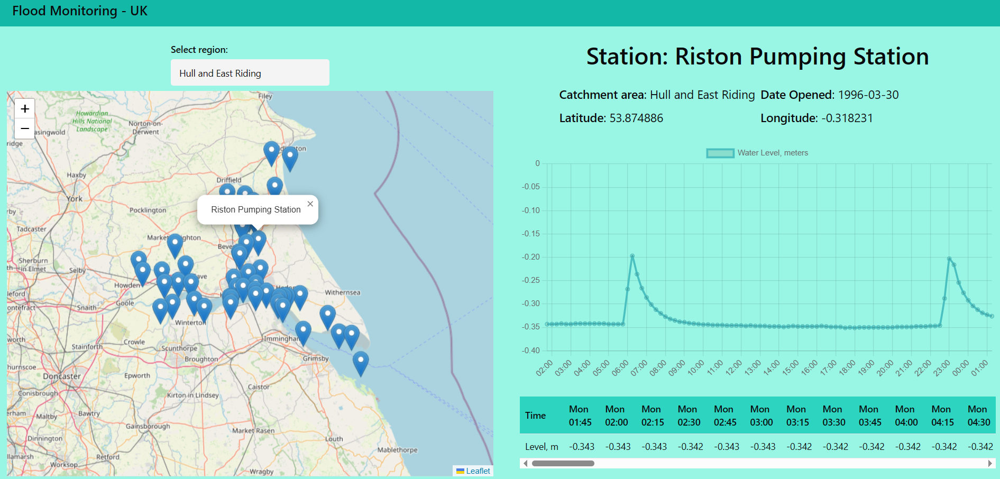

# Flood monitor

## Description

An interactive React app to monitor river and sea levels across all the UK.

## Demo

Visit [DEMO](https://raam337.github.io/Flood-screener/) to check functionality

## Features

Technologies used:
- React
- Typescript
- React Query
- React Router
- Chakra UI
- LeafletJS
- ChartJS

Features dynamic API fetch, real-time measurements of stations, dynamic map of station locations, line graph showing historic data.